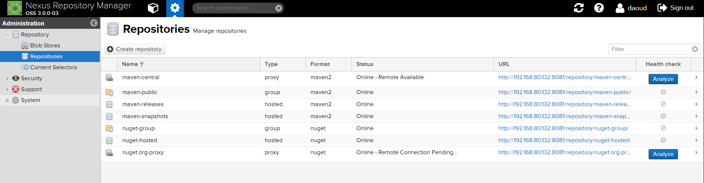
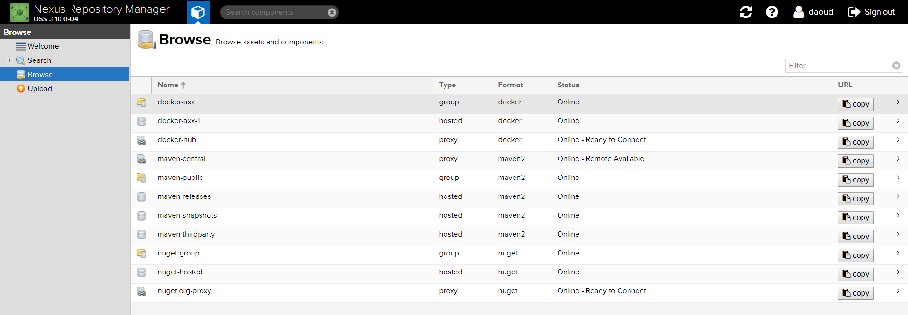

# Nexus Repository Manager

Nexus is your "own" repository that you can manage. It play a role of "proxy" allowing you to collect and manage your dependencies and artifacts and keep them inside the organisation.

This tutorial will focus on configuring Nexus with Maven.

## Installation
The easiest way is to run a docker 

	docker run -d -p 8081:8081 --name nexus sonatype/nexus3

or install it on cloud or on-promises server:
please check the following link for more info
https://help.sonatype.com/repomanager3/installation

## Nexus URLs

To configure maven to use Nexus, you need the following URLs:

 1. Maven hosted group URL
 2. Maven hosted snapshots URL
 3. Maven hosted release URL

You can find these URLs in different places based on Nexus version
### version OSS 3.0.0-03
  

#### version OSS 3.10.0-04
Click "copy" to get the URL
  


## Maven configuration  
The configuration is divided into two part:

 1. configure your maven (local setting) 
 2. configure project setting
    (pom.xml)

### 1- Local Maven Configuration  
first you have to configure maven setting to point to Nexus server. This is done by adding settings.xml file in your home path for maven ( maven will create a folder called .m2 in your home folder. for Linux it will be located in ~/.m2 and for windows C:\Users\USERNAME\.m2 will use it as local cache of the artifacts that you already downloaded 

Create new file in ${user.home}/.m2/settings.xml

```
<?xml version="1.0" encoding="UTF-8"?>
<settings xmlns="http://maven.apache.org/SETTINGS/1.1.0"
	xmlns:xsi="http://www.w3.org/2001/XMLSchema-instance"
	xsi:schemaLocation="http://maven.apache.org/SETTINGS/1.1.0 http://maven.apache.org/xsd/settings-1.1.0.xsd">

	<!-- default username and password when you run Nexus in docker -->
	<servers>
		<server>
			<id>nexus-snapshots</id>
			<username>admin</username>
			<password>admin123</password>
		</server>
		<server>
			<id>nexus-releases</id>
			<username>admin</username>
			<password>admin123</password>
		</server>
	</servers>

	<profiles>
		<profile>
			<id>nexus-local</id>
			<activation>
				<activeByDefault>false</activeByDefault>
			</activation>
			<properties>
				<mirror_cental_id>central</mirror_cental_id>
				<mirror_cental_url>http://YOUR_SERVER:8081/repository/maven-public/</mirror_cental_url>
				<nexus_spanshot_url>http://YOUR_SERVER:8081/repository/maven-snapshots/</nexus_spanshot_url>
				<nexus_release_url>http://YOUR_SERVER:8081/repository/maven-snapshots/</nexus_release_url>
			</properties>
		</profile>
	</profiles>

	<activeProfiles>
		<activeProfile>nexus-local</activeProfile>
	</activeProfiles>
	<mirrors>
		<mirror>
			<id>central</id>
			<name>central</name>
			<url>http://YOUR_SERVER:8081/repository/maven-public/</url>
			<mirrorOf>*</mirrorOf>
		</mirror>
	</mirrors>
</settings>
```

Using the profiles, you can easily change your project deployment to another server

### 2- Project Configuration  

 Here there are two options:


  ####  a- Configuration to download dependencies
  ~~In pom.xml add the flowing lines:~~
***This section is not needed since we already configure it is settings.xml in section 'mirrors'***
```
  <repositories>
    <repository>
      <id>maven-group</id>
      <url>http://YOUR_SERVER:8081/repository/maven-group/</url>
    </repository>
  </repositories>
```
and then you can use  

       $ mvn install 

####  b-  Configuration to upload artifacts (snapshot or release)

```
  <distributionManagement>
    <snapshotRepository>
      <id>nexus-snapshots</id>
      <url>${nexus_spanshot_url}</url>
    </snapshotRepository>
    <repository>
      <id>nexus-releases</id>
     <url>${nexus_release_url}</url>
    </repository>
  </distributionManagement>
```
Maven will get the variable values from Settings.xml. To deploy use

    $ mvn deploy

## Secure your password
Of course it is not a good idea to write down your password in plain text, especially if this password is for LDAP or Active Directory account.

Maven provide a solution to encrypt your password. You have to add additional settings-security.xml in ${user.home}/.m2

For more info check
https://stackoverflow.com/questions/30769636/how-does-maven-3-password-encryption-work

### 1- Master password 

 1. Create master password for encrypting/decryption 

	```
	$ mvn --encrypt-master-password <password>
	```
	the output will be something like
	```
	{V1E44GUTUFYHLqoCa+rf/qxdg06PFX2yTgnJlTxjvCA=}
	```
 2. add the following lines to file settings-security.xml

	```
	<settingsSecurity>
		<master>{jSMOWnoPFgsHVpMvz5VrIt5kRbzGpI8u+9EF1iFQyJQ=}</master>
	</settingsSecurity>
	```
		

### 1- Server password 
 - Create server password 
	```
	$ mvn --encrypt-password <password>
	```
	the output will be something like
	```
	{8Xm7QdJv8WMHfwU4B4KawjEB9TzK74CXg9Q/Ii8DkQE=}
	```
 - replace your plain password in settings.xml with encrypted password

	```
	<server>
		<id>nexus-releases</id>
		<username>admin</username>
		<password>{8Xm7QdJv8WMHfwU4B4KawjEB9TzK74CXg9Q/Ii8DkQE=}</password>
	</server>
	```
## Notes

 - Server id in settings.xml and pon.xml should match. For example if the server id for snapshots in settings.xml is "nexus-snapshots" and in pom.xml is "nexus-snapshot" (missing one letter 's') you will get error: 
	 ```
	 
	 Failed to deploy artifacts: Could not transfer artifact  ...... eturn code is: 401, ReasonPhrase: Unauthorized.
	```
- If you change your master encrypted password, you should encrypt the server password again
- If you try to encrypt server password without creating settings-security.xml you will get error :
	```
	java.io.FileNotFoundException: ${user.home}/.m2/settings-security.xml (The system cannot find the file specified)
	```
- You need "deploy" permissions to deploy your artifacts to Nexus if you are not the admin 
## Authors

[Shiyar Daoud ](https://github.com/shDaoud)

enjoy and happy coding


